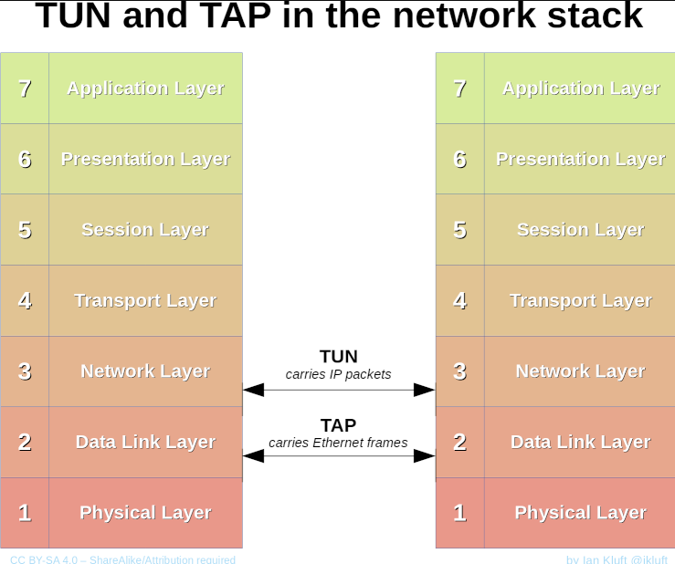

# `TUN/TAP` introduction

## Intro

- <https://docs.kernel.org/networking/tuntap.html>
- <https://vtun.sourceforge.net/tun/faq.html>
- <https://en.wikipedia.org/wiki/TUN/TAP>

TUN/TAP provides packet reception and transmission for user space programs.
In order to use the driver a program has to open `/dev/net/tun` and issue a
corresponding `ioctl()` to register a network device with the kernel.

## TUN

The TUN is Virtual Point-to-Point network device.

> 1.1 What is the TUN ?
> The TUN is Virtual Point-to-Point network device.
> TUN driver was designed as low level kernel support for
> IP tunneling. It provides to userland application
> two interfaces:
>
> - /dev/tunX - character device;
> - tunX - virtual Point-to-Point interface.
>
> Userland application can write IP frame to /dev/tunX
> and kernel will receive this frame from tunX interface.
> In the same time every frame that kernel writes to tunX
> interface can be read by userland application from /dev/tunX
> device.

## TAP

The TAP is a Virtual Ethernet network device.

<https://en.wikipedia.org/wiki/Test_Anything_Protocol>

> The **Test Anything Protocol** (TAP) is a protocol for
> communicating between test logic, called a TAP producer.
>
> TAP driver was designed as low level kernel support for
> Ethernet tunneling. It provides to userland application
> two interfaces:
>
> - /dev/tapX - character device;
> - tapX - virtual Ethernet interface.
>
> Userland application can write Ethernet frame to /dev/tapX
> and kernel will receive this frame from tapX interface.
> In the same time every frame that kernel writes to tapX
> interface can be read by userland application from /dev/tapX
> device.
